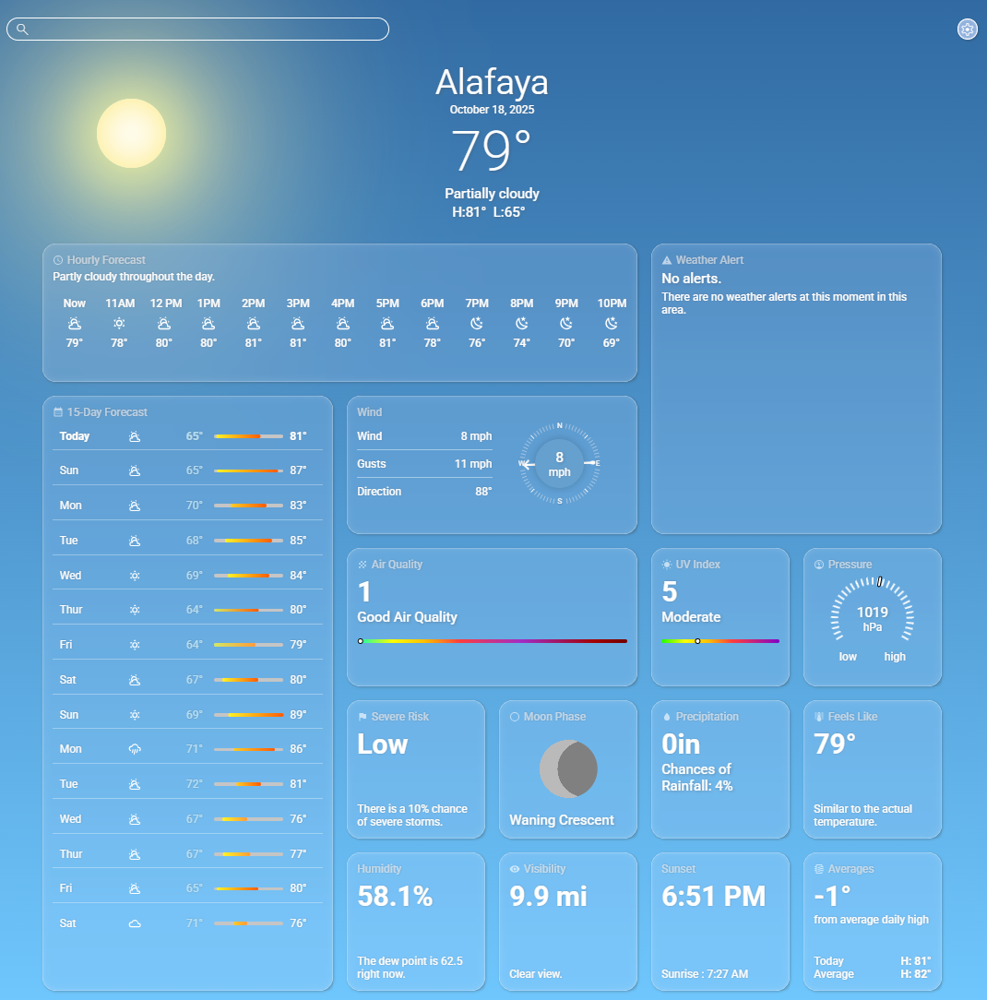

# Weather App

A clean and detailed weather forecast application that provides real-time weather data for any location. This app uses the Visual Crossing Weather API to deliver a comprehensive forecast, including detailed metrics like air quality, UV index, and wind speed.

### [Live Demo](https://eggtoasts.github.io/weather-app/)

<p align="center">
  
  
  
</p>

## Key Features

- **Real-Time Weather Data:** Fetches and displays weather conditions for any searched city.

- **Geolocation:** Automatically identifies the user's location to provide an instant local forecast on startup.
- **Comprehensive Details:** Access a wide range of meteorological data including humidity, precipitation, wind speed, "feels like" temperature, UV index, and air quality.
- **Hourly & Daily Forecasts:** View a 24-hour hourly forecast and a 15-day daily forecast.
- **Customizable Units:** A settings panel allows users to easily switch between Imperial and Metric units (Fahrenheit/Celsius, mph/kmh, etc.).
- **Dynamic Background:** The app background changes based on the time of day at the searched location.

## Technologies Used

- **HTML5**
- **CSS3**
- **JavaScript (ES6+)**
- **Visual Crossing Weather API**
- **Browser Geolocation API**

## Getting Started

Follow these instructions to get a copy of the project up and running on your local machine.

### Prerequisites

You will need to have [Node.js](https://nodejs.org/en/) installed on your machine. You will also need a free API key from [Visual Crossing Weather](https://www.visualcrossing.com/weather-api) and [Geolocation](https://ipgeolocation.io/)

### Installation

1.  Clone the repository to your local machine:
    ```bash
    git clone [https://github.com/eggtoasts/weather-app.git](https://github.com/eggtoasts/weather-app.git)
    cd weather-app
    ```
2.  Install the necessary NPM packages:
    ```bash
    npm install
    ```
3.  Create a file named `env.js` in the root directory and add your API key:
    ```javascript
    // env.js
    export const API_KEY = "YOUR_API_KEY_HERE";
    ```
4.  Run the development server:
    ```bash
    npm start
    ```
    The application will open automatically in your default browser.
